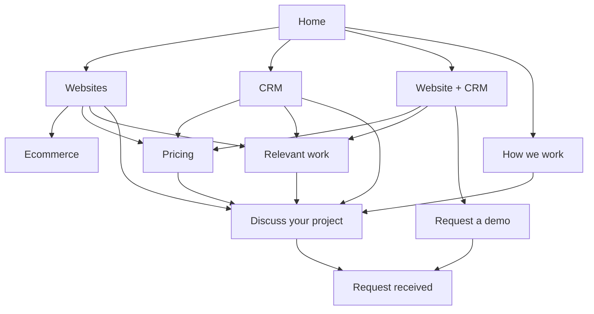

# Ingenium website rebuild: architecture, journeys and migration plan

Planning date: 26 September 2026. This is a build specification, not deployed website copy. No application code or production records were changed. The customer-facing labels specified below are proposed labels; editorial instructions must never appear on the public site. Full copy is supplied by the parallel copy workstream.

## 1. Decisions

Build the site around three independently understandable offers: websites, CRM projects, and a website with CRM built together. Present the combined offer as the flagship, without forcing it on someone who only needs a website or CRM. Ecommerce is a secondary website variant with its own scope page, not a fourth equal launch campaign.

Use `/connected` as the flagship canonical URL. It says what the customer is buying more clearly than `/platform`, which currently implies a broad software suite. Move `/platform` permanently to `/connected` only when the replacement includes its relevant content and is ready. Do not publish two substantially identical indexable pages. This is a clarity choice, not a claim that changing a slug itself improves rankings. If Search Console later shows substantial `/platform` equity and the owner elects to retain that URL, keep the same content plan and reverse the alias; never maintain competing canonicals.

Keep `/websites`, `/crm`, `/projects`, `/about` and the genuine trust routes. Consolidate implementation explanations into `/how-we-work`. Retain existing specialist intake paths and their backend semantics at first; simplifying navigation does not require breaking bookmarked forms or existing campaigns. `/contact` becomes a useful general enquiry form instead of another chooser that sends the visitor elsewhere.

The site should answer, in order: **Is this what I need? What will I get? Can these people do it? What will it cost? What happens next?** It should not require the visitor to learn “operating layers,” governance terminology or internal architecture before asking about a small-business website.

## 2. Evidence and existing implementation constraints

This plan uses the fresh public audit in [audit-public-site.md](audit-public-site.md), the launch research, and read-only inspection of sibling `C:/Users/kyler/Desktop/Projects/ingenium-website`.

Observed source surfaces:

- `lib/seo.ts` provides route metadata and `PUBLIC_DISCOVERY_PATHS`; `app/sitemap.ts` builds the sitemap from that list and portal projects. Both need deliberate updates alongside route changes.
- `app/(website)/contact/ContactForm.tsx` is shared by the three public intake pages. `lib/portalIntegration/forms.ts` defines the existing `contact` form slug and `Contact Form` label. `/website-brief` uses separate slug `website-project-brief` and label `Website Project Brief`.
- `contact/pathContent.ts` maps demo intent `book-demo` to `/demo/confirmed`; teardown intent `revenue-systems-teardown` to `/revenue-systems-teardown/confirmed`; technical intent `technical-review` to `/technical-review/confirmed`.
- `lib/portalIntegration/projects.ts` provides publication state, slug, website fields and optional proof fields. Project pages currently include missing-field presentation paths that must remain an editor concern, not a public experience.
- Local source has commerce `/products` routes and legacy/internal routes beyond the 21 routes in the observed live static sitemap. This does not establish that every local feature is deployed. Preserve them intentionally until ownership is resolved; do not delete them as accidental collateral of the marketing rebuild.
- `next.config.ts` currently contains no central redirect table; some legacy redirects are implemented inside route pages. Inventory both locations when adding redirects.

## 3. Proposed sitemap and navigation placement

```text
Home /
├── Services /services                      [dropdown overview; secondary hub]
│   ├── Websites /websites                  [primary lane]
│   ├── CRM /crm                            [primary lane]
│   ├── Website + CRM /connected            [flagship lane]
│   └── Ecommerce /ecommerce                [secondary scope]
├── Our work /projects                      [primary navigation]
│   └── Approved project /projects/{slug}   [stable existing slugs]
├── How we work /how-we-work                [primary navigation]
├── Pricing /pricing                        [primary navigation]
├── Discuss your project /contact           [primary action]
│   └── Request received /contact/thanks    [new; noindex]
├── About /about                            [footer; people/team section]
├── Request a demo /demo                    [connected contextual CTA]
│   └── /demo/confirmed                     [retain; noindex]
├── Workflow review /revenue-systems-teardown [contextual; existing intent]
│   └── /revenue-systems-teardown/confirmed  [retain; noindex]
├── Technical review /technical-review      [trust contextual CTA]
│   └── /technical-review/confirmed          [retain; noindex]
├── Supporting capabilities
│   ├── Automations /automations            [contextual/footer; retained]
│   └── AI support /ai-agents               [contextual/footer; retained]
├── Trust and client support
│   ├── Security /security                  [overview]
│   ├── Security review /security-review    [process]
│   ├── Data handling /data-handling        [actual data practices]
│   ├── Privacy /privacy                    [visitor notice]
│   ├── Support /support                    [existing-client route]
│   ├── Terms /terms                        [new, only after approval]
│   └── Ownership and leaving /ownership    [new commercial summary]
└── Existing nonmarketing surfaces
    ├── /website-brief                      [client intake; preserve noindex]
    ├── /internal/...                       [preserve; authenticate as required]
    ├── /products and /products/{slug}      [commerce ownership decision; separate]
    └── /api/ingenium/revalidate            [retain integration endpoint]
```

`/terms` and `/ownership` are proposed new pages, not claims that approved contractual language already exists. Do not fabricate policy language, promised SLAs or source-code rights. Review the actual commercial model before these become publishable.



### Desktop header

Logo → `/`. Ordered links: **Services** dropdown, **Our work** → `/projects`, **How we work** → `/how-we-work`, **Pricing** → `/pricing`. Right action: **Discuss your project** → `/contact`.

Services dropdown order: Websites → `/websites`; CRM → `/crm`; Website + CRM → `/connected`; Ecommerce → `/ecommerce`. Give the combined offer a small textual cue such as “Built together,” not a badge claiming unverified popularity. Provide “Compare services” → `/services` as an optional text link. A dropdown trigger must be a button with a clear expanded state; do not combine accidental navigation and expansion in the same click target.

Remove the current upper utility strip of technical review/teardown/projects/contact from the default marketing header. Technical review remains discoverable in Security, CRM FAQs and the footer. Support is available in the footer and contact page. Do not duplicate multiple equal-strength demo buttons in the same header.

### Mobile header and menu

Keep logo, labelled menu button and sufficient tap space. Inside the open menu show Services as an accordion, then Our work, How we work, Pricing, About, Support, and the full-width project CTA. Expanding Services must not close the whole menu. Selecting a route closes the menu and resets scroll appropriately; Escape closes and restores focus; focus does not move behind an open overlay. Preserve browser back behaviour. The menu is a control, never just a decorative icon.

No permanently fixed mobile sales bar at initial release: a strong first-screen CTA and repeated contextual actions are sufficient, and a bar can obstruct forms/cookie controls. Reconsider with data rather than adding it by default. Keep pricing tables scroll-safe or stack their rows; do not hide billing conditions to fit the screen.

### Footer

- **Services:** Websites, CRM, Website + CRM, Ecommerce, optional Automation and AI support.
- **Company:** Our work, How we work, About, Contact; verified LinkedIn/business-profile links.
- **Clients and trust:** Support, Security, Security review, Data handling, Privacy; approved Terms and Ownership pages once ready; cookie preferences if optional tracking is used.
- Verified business identity, contact details and service region. Maintain accessible email/phone links and a support route that does not require choosing a sales package.

No SEO-only footer link dump, duplicated slogan blocks or internal review metadata unless it helps a buyer judge a material policy. An internal content-review calendar belongs in operations.

## 4. End-to-end journeys by lane

| Visitor and trigger | Entry page | Decision path | Primary next step | Intake lane | Proof needed |
|---|---|---|---|---|---|
| Owner wants a first/replacement website | `/websites` | Work sample → included scope → cost → process | `Discuss your website` → `/contact?service=website` | `website` | Approved website screenshots and delivered scope |
| Team loses follow-up in inboxes/spreadsheets | `/crm` | Current problem → implementation scope → fit → cost | `Discuss your CRM` → `/contact?service=crm` | `crm` | Actual workflow demonstration or approved CRM implementation |
| Business wants site and follow-up designed together | `/connected` | Form-to-follow-up walkthrough → included connection → scope → price | `Request a demo` → `/demo?service=connected` | `connected`, existing `book-demo` intent | Working scoped demonstration, clearly labelled if not client data |
| Retailer needs online sales | `/ecommerce` | Catalogue/operations fit → store scope → dependencies → price | `Discuss your store` → `/contact?service=ecommerce` | `ecommerce` | Genuine store work if approved; otherwise labelled demo |
| Visitor knows the name but not which service | `/` or `/services` | Three clear choices; optional store route | Relevant lane, or `/contact?service=not-sure` | `not-sure` | Company/project credibility |
| Existing client has an issue | `/support` | Choose normal/urgent route under actual agreement | Existing support channel or contact with support intent | separate support routing | No marketing pitch required |

The `service` values above are proposed front-end routing values. Do not assume they are accepted backend enums. Map them to approved portal fields before implementation. Store human-readable choices as well as stable keys where the contract supports them.

Specific flow rules:

1. Website ads land on `/websites`, not the broad homepage or technical review. CRM ads land on `/crm`; combined ads on `/connected`.
2. A price card passes its lane/offer to contact without starting a checkout unless the scope truly supports self-service purchase. The first launch should request a scoped proposal, not collect money against undefined delivery.
3. Contact form visibly confirms the selected service and allows correction. Unknown/malformed query values default to “Not sure”; never silently treat them as an expensive package.
4. Related work returns to the originating lane through a contextual CTA. Do not lose lane context just because the buyer visits a case study.
5. A request acknowledgment states “request received” and what happens next. It must not state “meeting booked” until a scheduling system has actually confirmed a slot.
6. Keep CRM-only valid: do not insist on a website rebuild. Keep website-only valid: do not state everyone requires a CRM.

## 5. Page-by-page build specification

Numbers below define section order. Every page begins with one H1 and a short description. Primary actions repeat near the end, but not as a button after every paragraph. This is structure for the copy team, not final visible copy.

### Home `/`

**Purpose:** Orient a business owner and route them to a relevant offer; make combined delivery memorable.

1. Hero: clear website/CRM offer, target customer/region, project CTA → `/contact`, secondary “See our work” → `/projects`.
2. Compact approved work strip: 2–3 real projects/screenshots if publishable, otherwise labelled example work without invented clients.
3. Three-lane chooser: Website, CRM, Website + CRM; each has one buyer need, a concrete deliverable and link to its lane. Make combined visually prominent without hiding the alternatives.
4. Connected workflow example: enquiry → record → owner → follow-up. Link “See the connected service” → `/connected#workflow`.
5. Selected work in more depth; use evidence of delivered work if outcome metrics are unavailable.
6. How delivery works: scope, build, review, launch; link `/how-we-work`.
7. Pricing orientation: real approved starting points or clear project/ongoing model; `/pricing`. Do not publish provisional numbers from a planning file as approved prices.
8. Team/accountability: named people and what they own; `/about#team`.
9. Concise FAQ: standalone purchases, existing systems, ownership, next steps; final CTA `/contact`.

**Avoid:** long AI capability catalogue, internal terms, fake numerical proof, three separate request forms, or a generic platform demo as the only path.

### Websites `/websites`

**Purpose:** Sell a complete standalone website project and make an optional connected upgrade understandable.

1. Hero with website-specific outcome; primary `/contact?service=website`, secondary relevant project anchor/list.
2. Website examples with concise captions describing actual scope.
3. What is included: agreed page count/types, design/content responsibility, mobile behaviour, forms, basic search foundations, analytics subject to consent, launch/handover.
4. Common buyer situations: first site, dated site, unclear enquiry path; keep this practical.
5. Build process and delivery assumptions; `/how-we-work`.
6. Price/model card linking `/pricing#websites`; explain care separately from build.
7. Ownership/support answers, `/ownership` and `/support` when approved.
8. Optional upgrade: why/when CRM helps; `/connected`. Separate store route → `/ecommerce`.
9. FAQs and final project CTA.

Do not list advanced SEO, copywriting, migration or unlimited edits unless specifically included in the offer.

### CRM `/crm`

**Purpose:** Sell process setup/migration/adoption, not another unexplained software licence.

1. Hero; primary `/contact?service=crm`, secondary “See an example workflow” → `#workflow`.
2. Recognisable problems: ownership, next actions, duplicates, pipeline visibility.
3. Workflow example with synthetic records clearly labelled; show the staff action, not just a dashboard.
4. What the project covers: process design, data fields, migration allowance, pipeline, workflows, reporting, permissions and training. State limits.
5. Existing systems/fit: retain, improve or replace; list supported platforms only once confirmed.
6. Delivery and adoption: pilot, acceptance checks, training, launch, review.
7. Pricing components: implementation, licences, usage, ongoing assistance; `/pricing#crm`.
8. Evidence: approved CRM case if available; otherwise demonstration plus delivery process, not a website client portrayed as a CRM customer.
9. Data/security questions linking genuine trust pages; technical review → `/technical-review?service=crm` as a secondary expert route.
10. FAQ and final CRM enquiry CTA; optional `/connected` for businesses also rebuilding a site.

### Website + CRM `/connected`

**Purpose:** Explain and prove the flagship combined offer.

1. Hero with one clear combined promise; primary `/demo?service=connected`; secondary `#workflow`.
2. Working or recorded 60–90-second workflow: submit an enquiry, see its record/source, see assignment and next action. Provide captions/transcript. Label demo data.
3. The customer problem and the operational change; use one concrete example rather than architecture jargon.
4. Included website scope + included CRM scope + included core connection; display exclusions alongside, especially external/legacy integrations, messaging usage and complex migration.
5. Before/after process illustration, not invented ROI.
6. Relevant evidence: combined client only if actually delivered and permitted; otherwise independent site evidence and explicitly labelled system demo.
7. Implementation stages and dependency assumptions; `/how-we-work#connected`.
8. Price/model and first-year illustration; `/pricing#connected`.
9. Ownership, support and boundaries; genuine trust links.
10. Fit/FAQ including “already have a site/CRM?” with `/websites` and `/crm` alternatives; final demo request.

Use “core website-to-CRM connection included in the agreed scope” if verified. Avoid “no integration costs” for every possible outside tool.

### Ecommerce `/ecommerce`

**Purpose:** Qualify manageable stores and avoid underquoting operational complexity.

1. Store-specific hero; `/contact?service=ecommerce`.
2. Genuine ecommerce examples or labelled concept, never a service catalogue falsely described as a transacting store.
3. Fit/scope: catalogue, variants, payments, shipping, tax configuration, returns, staff handover.
4. Included initial product/import allowance and client content responsibilities.
5. Systems beyond the storefront: inventory, accounting, fulfilment and CRM; quote separately where necessary.
6. Test-order/refund/notification and mobile checkout acceptance approach.
7. Price architecture separating build, platform/apps, processing and support; `/pricing#ecommerce`.
8. FAQs and enquiry CTA. For high-value trade enquiries cross-link `/connected` only where useful.

### Pricing `/pricing`

**Purpose:** Let buyers compare commitment and total cost, not just a small periodic number.

1. Short explanation of scoped projects and optional ongoing support; currency/VAT convention.
2. Three lane cards with anchors `#websites`, `#crm`, `#connected`; deliverables, boundaries, setup, recurring price, term, intended buyer and lane-specific CTA. Use approved commercial decisions only.
3. Secondary ecommerce scope strip `#ecommerce`.
4. Included/excluded comparison: pages, revisions, users/records/workflows, migration, licences, messaging, support and changes. Put “custom quote” where scope is genuinely variable.
5. Billing explanations and first-year examples. If weekly is offered, show 52 collections and annual total; monthly means 12 collections. A weekly equivalent display must say what is actually billed.
6. Ownership/cancellation summary with `/ownership` and `/terms`.
7. FAQ: deposit, launch conditions, ongoing support, upgrades and outside platforms.
8. “Not sure which fits?” → `/contact?service=not-sure`.

Do not use price-toggle animation to obscure scope or change contract length without explanation. Keep comparable columns/rows on mobile.

### Our work `/projects`

**Purpose:** Demonstrate completed work and route buyers toward the relevant service.

1. Plain introduction to the published selection.
2. Optional simple filters for Websites, CRM, Connected, Ecommerce only when sufficient approved projects exist. With three projects, a straightforward list is better than mostly empty filters.
3. Project cards: real client/name permission, screenshot, actual service, brief scope, detail URL. No fabricated percentage improvements.
4. Delivery standards or brief explanation of how examples were selected.
5. CTA `/contact`, preserving a selected service where relevant.

### Project detail `/projects/{slug}`

**Purpose:** Explain the problem, exact work and evidence without claiming unsupported outcomes.

1. Client/project and factual summary; breadcrumb `/` → `/projects` → current project.
2. Screenshot/approved visual with useful alt text.
3. Client context and initial need.
4. Scope delivered, responsibilities and boundaries.
5. Key design/workflow decisions illustrated.
6. Outcomes only when verified: baseline, measurement period, source and attribution limits. If absent, label the section “What we delivered” and omit outcome counters.
7. Optional approved client quote and live-site link.
8. Related service → correct lane; CTA “Discuss a similar project” → `/contact?service=...&project=approved-slug`.

Do not automatically render amber missing-field placeholders, internal publication statuses or portal field names. Optional missing fields disappear; missing required publication fields block publishing.

### How we work `/how-we-work`

**Purpose:** Replace two overlapping process pages with a credible delivery plan.

1. Simple process promise and `/contact` CTA.
2. Discover/scope: inputs, decision owner, written scope.
3. Design/configure: reviewable work and milestones.
4. Build/test: route/form/data tests, customer review and training.
5. Launch/handover: access, ownership, documentation, agreed support.
6. Lane differences using `#websites`, `#crm`, `#connected`, `#ecommerce`; show timing ranges only after capacity validation and state when the clock starts.
7. Client responsibilities, revisions and change requests.
8. Ongoing care and data/security links.
9. FAQ and next step.

### About `/about`

**Purpose:** Establish who will do the work and why the customer can trust the team.

1. Specific company introduction and region.
2. Team section `#team`: names, real roles, verified photos and direct profile links where approved.
3. How responsibilities are divided; remove unnecessary agency comparisons.
4. Working principles expressed as practices, not vague values alone.
5. Work links and business identity/contact.
6. `/contact` CTA.

Merge current team content only after all important personal/profile content is preserved. Team member roles should be owner-reviewed before publishing.

### Contact `/contact`

**Purpose:** Accept an enquiry immediately and explain the next step.

1. Brief project invitation; what a response will contain and realistic response window.
2. One-page form: name, email, service choice, brief description. Optional expandable details: website URL, company, phone, timeline, appropriate EUR budget and current tools. Do not require all fields simply because the backend can store them.
3. Privacy link at collection and independent optional marketing preference with approved wording.
4. Submission result with actual transport acknowledgment; redirect to `/contact/thanks` only after backend success.
5. Alternative email/phone and existing-client support link; demo and technical-review links as optional alternatives, not prerequisites.

Form is fully usable with optional analytics rejected. Email validation and visible focus/error handling happen on this page; no hidden-step validation traps.

### Existing specialist intake pages

`/demo`: one-page request form, what will be shown, expected duration if operationally agreed, and response expectation. Primary label “Request a demo.” Keep `book-demo` backend intent and `/demo/confirmed`; visible wording need not preserve the historical field name. If actual calendar booking is later introduced, only confirmed provider success produces a booked status.

`/revenue-systems-teardown`: position as a workflow review, state actual output and whether it costs anything; do not silently promise a free audit. Keep route/intent/confirmation for compatibility. Optional tools/process details can be expanded.

`/technical-review`: concise scope and request form for genuine technical due diligence. Keep existing intent/confirmation. Do not promise a pre-existing security pack unless there is one ready to send.

All specialist confirmations: noindex, truthful request acknowledgment, contact fallback, next step; no marketing conversion based purely on loading a confirmation URL.

### Supporting and trust pages

| Page | Section order and action |
|---|---|
| `/services` | Short chooser → 3 primary service summaries → secondary ecommerce → which fits → `/contact`; retain as useful link target, not a duplicate homepage |
| `/automations` | Specific use cases → inputs/permissions → included versus custom → actual example → fit → `/contact?service=crm`; link CRM and Connected |
| `/ai-agents` | Actual available assistance → human review/boundaries → data prerequisites → real demo → scoped enquiry; supporting capability, not lead launch offer |
| `/security` | Factual controls/limitations → responsibility split → review materials that exist → links to data handling/privacy/security-review → `/technical-review` |
| `/security-review` | Review purpose → scope → required inputs → actual output → `/technical-review`; preserve distinct process intent |
| `/data-handling` | Roles/purposes → access/data flow → actual processors/regions where known → retention/deletion → enquiry route; approved factual content only |
| `/privacy` | Identified controller/contact → purposes and lawful bases → actual recipients/transfers → retention → rights/complaints → preferences; adviser-approved |
| `/support` | Existing-client route → information to include → actual hours/response terms → urgent escalation under agreement → change requests; no sales-form maze |
| `/ownership` | Domain/content/data rights → code versus platform rights → export/handover → ending service and costs → links to binding terms/support |
| `/terms` | Approved contracting entity/service terms with dates/version; links to privacy/ownership/support; not generated placeholder legal text |

## 6. Complete live static-route migration matrix

All 21 rows correspond to the static routes observed in the live sitemap. “Permanent” means a server-side permanent redirect (301 or framework 308), not a client-side script. Use one hop, update internal links and remove redirected URLs from the sitemap. Preserve meaningful query parameters without propagating personal data; avoid redirecting POST form submissions.

| Current route | Decision | New destination/status | Content and implementation requirement |
|---|---|---|---|
| `/` | Rewrite | `/`, 200 canonical | Three-lane orientation; retain business identity and approved work references |
| `/platform` | Replace/redirect at release | `/connected`, permanent | Equivalent connected capabilities/workflow content moved; no duplicate indexable version |
| `/services` | Retain/rewrite | `/services`, 200 canonical | Useful offer chooser; secondary hub |
| `/websites` | Retain/rewrite | Same, 200 canonical | Make standalone offer explicit; preserve genuine website search intent |
| `/crm` | Retain/rewrite | Same, 200 canonical | Separate licences from project work; retain migration/integration intent |
| `/ai-agents` | Retain/rewrite, demote nav | Same, 200 canonical | Actual supported AI assistance; do not blanket redirect unrelated AI search intent |
| `/automations` | Retain/rewrite, demote nav | Same, 200 canonical | Supporting use-case page; preserve automation search intent |
| `/security` | Retain/rewrite | Same, 200 canonical | Accurate trust overview; remove editorial labels |
| `/data-handling` | Retain/review | Same, 200 canonical | Actual policy, not marketing rewrite alone |
| `/privacy` | Retain/review | Same, 200 canonical | Complete approved visitor notice; existing consent links remain valid |
| `/security-review` | Retain/rewrite | Same, 200 canonical | Process explanation distinct from intake route |
| `/support` | Retain/rewrite | Same, 200 canonical | Current-client path remains reachable |
| `/implementation-methodology` | Merge/redirect | `/how-we-work`, permanent | Preserve discovery/testing/launch information in equivalent destination |
| `/implementation` | Merge/redirect | `/how-we-work`, permanent | Preserve useful rollout and ownership content; discard editorial H1 |
| `/contact` | Retain/rebuild | Same, 200 canonical | Actual general form and direct contact; backend contract approved before launch |
| `/demo` | Retain/rewrite | Same, 200 canonical | Preserve `contact` slug, `book-demo` intent and confirmed route initially |
| `/revenue-systems-teardown` | Retain/rewrite | Same, 200 canonical | Preserve review-specific intent; reduce jargon in visible copy |
| `/technical-review` | Retain/rewrite | Same, 200 canonical | Preserve technical intake and routing |
| `/projects` | Retain/rebuild | Same, 200 canonical | Reliable approved proof publication; no raw empty feed explanation |
| `/about` | Retain/expand | Same, 200 canonical | Absorb team section while preserving company identity |
| `/team` | Merge/redirect at release | `/about#team`, permanent | Copy all approved team content/profile links first; target anchor exists |

New canonical routes: `/connected`, `/ecommerce`, `/pricing`, `/how-we-work`, and approved `/ownership` and `/terms`. New noindex result route: `/contact/thanks`. Query variants such as `/contact?service=crm` canonicalise to `/contact`; they are not separate sitemap entries.

## 7. Dynamic projects, legacy routes and nonmarketing surfaces

### Project preservation and publication

Do not rename project slugs during the design rebuild merely to shorten them. Known homepage-linked slugs need an explicit content/publication decision:

| Existing project URL | Proposed decision | Required before link is public |
|---|---|---|
| `/projects/carlow-hearing-service-led-clinic-website` | Preserve exact slug if approved project exists | Approved client identity, actual website delivery scope, valid detail response |
| `/projects/kenny-construction-limited-website-rebuild` | Preserve exact slug if approved project exists | Approved screenshots/scope; no invented performance lift |
| `/projects/holland-pianos-ireland-premium-service-website` | Preserve exact slug if approved project exists | Actual service-catalogue delivery described accurately; not assumed ecommerce checkout |
| Every other portal-published `/projects/{slug}` | Preserve | Export old canonical list, publication permission and resolved live destination |

A missing record is not permission to invent a case study. If content cannot be republished, remove promotional cards and sitemap entries. Use a relevant permanent redirect only if an equivalent replacement exists; otherwise return an honest 404/410. Do not redirect all removed project URLs to the homepage or make a branded “not found” page return 200.

### Reliable proof states

1. **Published and complete:** Render from validated approved content; required fields must exist. Optional quote/metric sections render only when sourced.
2. **Temporary feed failure:** Serve a versioned last-successful approved snapshot or controlled cached response, alert operations, and keep canonical pages stable. No internal endpoint/portal-field explanations in customer copy.
3. **Zero publishable records with no snapshot:** Show a deliberately designed work/process overview or a labelled demonstration; do not show fake customer cards, blank grids or “mark projects for website display” instructions. Omit customer-specific links until their detail pages exist. The overview remains useful and honest.
4. **Withdrawn publication permission:** Remove the record and invalidate its cached snapshot as part of withdrawal; stale fallback must never resurrect withdrawn material.
5. **Unknown slug:** Real 404. **Known published slug during dependency outage:** prefer safe cache; without it, temporary error handling with retry semantics is more truthful than claiming the project never existed.

The home work strip, lane proof modules, project hub, detail routes and sitemap must all use the same approved publication selection. This prevents the present mismatch between hard-coded homepage stories and an empty project feed. Keep admin/editor previews separate from public rendering.

### Additional source-discovered routes

| Route/pattern | Plan |
|---|---|
| `/case-studies` | Retain existing permanent redirect to `/projects` |
| `/case-studies/{id}` | Preserve explicit existing ID→canonical project mappings; audit each destination; unknown IDs remain404, no wildcard homepage redirect |
| `/agents` | Retain direct permanent redirect to `/ai-agents` |
| `/departments` | Keep existing noindex while owner reviews actual need; do not add to new navigation/sitemap or delete unseen content |
| `/demo/confirmed`, `/revenue-systems-teardown/confirmed`, `/technical-review/confirmed` | Preserve paths and success semantics; noindex and exclude sitemap; rewrites must not break redirects after submission |
| `/website-brief` | Preserve route, identifiers, client-link parameters, noindex and existing intake contract; do not turn it into an acquisition form |
| `/internal/revenue-calculator` and `/internal/*` | Keep out of nav/sitemap; verify access protection separately; robots is not authentication |
| `/products`, `/products/{slug}` | Separate commerce surface in local source, not same as agency `/ecommerce`; preserve unless owner explicitly retires it; avoid confusing store products with agency packages |
| `/api/ingenium/revalidate` | Preserve integration contract/authentication; update invalidation targets for renamed pages and shared proof snapshots |
| `/llms.txt`, robots, sitemap, social preview | Refresh discovered public routes and descriptions; list canonical URLs; retain meaningful exclusions consistently |

Before implementation export all current published/legacy mappings from source and portal, compare with analytics/Search Console if accessible, and expand this manifest. The three known homepage slugs are not an exhaustive inventory of historical URLs.

## 8. Form and attribution contract

Use a single visible page with optional details, shared accessible components, and separate intent handling. Keep existing slug/name identifiers until a coordinated portal change is tested. New visual labels do not require renaming stored historic intent keys.

Proposed submission fields, subject to existing API schema validation:

- Required business request: name, email, selected lane/uncertain choice, short request description.
- Existing compatible identifiers: `data-form-slug="contact"`, existing name/label, explicit intent; preserve known `book-demo`, `revenue-systems-teardown`, `technical-review` for retained paths.
- New general-contact intent/field mapping must be agreed with portal routing rather than guessed. If unsupported, extend and deploy the contract in a controlled coordinated change.
- Optional relevant detail: website URL, organisation, phone, timeline, current tools, budget expressed in EUR with “not sure.” All optional fields clearly labelled.
- Attribution: validated lane/offer key, source route, campaign identifiers where lawful/appropriate, approved referring project slug. Keep personal data out of URLs and analytics event names. Preserve campaign query parameters through relevant redirects without letting them select arbitrary internal destinations.
- Privacy: versioned displayed notice/acknowledgment, exact text snapshot, timestamp and independent optional marketing choice. Essential request handling must not depend on optional analytics consent.

Success requires authoritative backend acknowledgment, not a click or navigation. Prevent accidental duplicate submissions; explain validation/transport errors inline and retain entered data. Keyboard focus goes to the first invalid visible field or error summary. Form submit errors must not vanish when analytics is unavailable. Never send test enquiries to production during routine implementation without the agreed smoke-test procedure.

## 9. Audit-to-build traceability

| Public audit finding | Architecture response | Release acceptance |
|---|---|---|
| PUB-01 tracking gate | Form transport independent of optional analytics; cookie preference access in footer | Reject/accept/withdraw tests plus successful essential form path |
| PUB-02 notice gaps | Retain `/privacy` and `/data-handling`; approved factual rewrite | Notice matches actual purposes/tools and linked at collection |
| PUB-03 budget mismatch | Lane-prefilled short contact form, optional EUR budget | Every approved offer fits an obvious band; no unexplained25k floor |
| PUB-04 lanes not separable | `/websites`, `/crm`, `/connected`; honest optional cross-sell | Each can be understood and enquired about independently |
| PUB-05 editorial copy | Customer-copy pass across every retained route | No planning labels or portal instructions in public body/metadata |
| PUB-06 CTA detour | Direct lane→contact/demo routes, truthful request wording | Primary CTA predicts destination; no chooser loop |
| PUB-07 consent snapshot | Shared versioned copy source; inline privacy link | Exact displayed text recorded in staging |
| PUB-08 email progression | One-page validation and visible error focus | Malformed email rejected before network submit |
| PUB-09 ownership/support | Approved pricing/ownership/terms/support definitions | Price, contract, billing and exit example reconcile |
| PUB-10 stale review dates | Actual per-page content review/change records | No artificial timestamp refresh; public cadence claims kept only if maintained |
| PUB-11 robots groups | Consistent exclusions; private-surface treatment | Expected behaviour verified for wildcard and named bot groups |
| PUB-12 unscoped claims | Offer/capability matrix and lane timing assumptions | Every advertised function demonstrable or expressly scoped |
| Existing project-feed issue | Shared publication source and safe snapshot states | Home, hub, details and sitemap agree under success/failure/withdrawal tests |

## 10. Build sequence and release checklist

**Phase 1 — lock contracts and evidence.** Finalise packages, owned-versus-licensed model, actual support capacity, proof permissions and implementation capability matrix. Export URL/redirect/form manifests. Do not block all design work while waiting for optional proof; use labelled demonstrations in prototypes.

**Phase 2 — build navigation and content templates.** Header/footer, lane pages, pricing, project templates, how-we-work, about and one-page intake. Use the approved copy document; keep this specification out of visible components. Add accessible navigation and responsive tables at component level.

**Phase 3 — wire real behaviour.** Portal form contract, approved project publication/fallback, consent and independent request handling, success/error routes and attribution. Update metadata, structured data, sitemap, llms and redirect mapping as one coherent set.

**Phase 4 — review in staging.** Walk all four buyer journeys; verify valid/invalid/error/no-analytics form paths; check mobile menu/focus, 390px and larger layouts, zoom, keyboard and reduced motion. Test proof-feed outage and permission withdrawal. Verify all21current static routes and every exported dynamic/legacy route have the intended outcome; test redirects one hop and preserved queries.

**Phase 5 — release and observe.** Deploy destination pages before/with permanent redirects; clear only relevant cached content; verify deployed responses after revalidation. Run the authorised production smoke test and confirm receipt/routing. Monitor 404s, form failures and qualified conversions by lane. Retain a rollback version that restores compatible routes/forms rather than leaving half the new navigation live.

Release should fail if any primary CTA leads to an absent page, a published project card leads to unavailable proof, a form success is shown without backend confirmation, pricing cannot be reconciled with terms, or migration creates canonical/redirect loops. SEO preservation means a disciplined relevant migration; no plan can guarantee unchanged rankings without performance data and post-launch observation.
