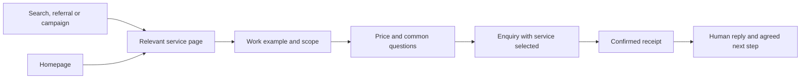

# Ingenium website rebuild: design, content, journeys and launch specification

Prepared 26 September 2026. Planning deliverable; the live website and application have not been rebuilt or changed by this work.

## 1. The website we are building

Build a clear, confident website for Irish business owners choosing a website partner, a CRM implementation, or both together. Make **website + CRM delivered together** the flagship while giving standalone buyers equally clear routes. The site should explain the work, demonstrate the customer journey, show relevant proof, state what is included and make a useful conversation easy to request.

The design direction is **calm competence, visible work and precise detail**. Keep the existing Ingenium logo and recognisable blue/teal identity. Use a light mineral canvas, generous but purposeful spacing, strong typography, real project imagery and a small working example of an enquiry progressing into a customer record. Present a service people can understand and buy.

The launch-readiness audit is part of this specification. A visually finished page with unreliable forms, unverified conversion counts or unsupported claims is not a completed rebuild.

### The complete handoff

| Document | Purpose |
|---|---|
| **This plan** | Design direction, styling, layouts, motion, states, audit integration and delivery sequence |
| [Customer-facing copy deck](WEBSITE-COPY-DECK.md) | The text to render on pages, controls and user-facing states |
| [Architecture and migration plan](WEBSITE-ARCHITECTURE-PLAN.md) | Every route, user journey, page structure and migration decision |
| [Build tickets and acceptance tests](WEBSITE-BUILD-ACCEPTANCE.md) | Technical work, dependencies and release evidence |
| [Launch-readiness audit](LAUNCH-READINESS-AUDIT.md) | Observed/source findings and operational checks behind the work |
| [Launch marketing plan](INGENIUM-LAUNCH-PLAN.md) | Offer strategy, proposed prices, audience, channels and campaign sequence |

**Copy rule:** internal headings, implementation notes, source references, acceptance instructions and publication gates in these planning documents must never be rendered as website content. The copy deck marks public strings separately. Build public content from an explicit content schema, not by rendering an entire planning Markdown file.

### Decisions already grounded in the research

- Ireland first; owner-led service businesses are the initial commercial focus. Professional/specialist services and construction/home improvement supply useful examples.
- Three principal buying routes: Websites, CRM, Website + CRM. Ecommerce is a secondary service page with separate scope.
- Implementation fee plus monthly service. Weekly equivalents remain an optional later test, not the lead pricing display.
- Real, bounded demonstrations and permissioned work. No invented revenue uplifts, client quotes, certifications or scarcity.
- Initial conversion is a requested conversation/review, unless a real scheduling flow has been implemented and accepted.
- Automation and AI appear only where released and demonstrable. An automation editor is not evidence of live execution.

### Design context and retained assets

Use the public site's [design context](../../../ingenium-website/.impeccable.md), not the Portal application's internal-operator design brief. Its premium, helpful and knowledgeable personality suits this audience. The older draft [brand guide](../../../ingenium-website/website%20rebuild/ingenium-brand-guidelines.md) supplies identity continuity; its sweeping AI promises and old all-Inter typography are not the new content specification.

The current marketing [layout](../../../ingenium-website/app/layout.tsx) already uses Manrope and Public Sans. Retain that pairing and remove routine decorative monospace labels. The improvement comes from hierarchy, composition, proof and useful interactions, rather than an unnecessary font change.

## 2. Success criteria

A first-time visitor should be able to identify the relevant service, explain what Ingenium would deliver, find a price/scope starting point and know what happens after contacting the team. Test this with five target buyers using real pages, not leading questions. This is a qualitative usability check, not statistical proof of improved conversion.

Measure the launched site by accepted enquiries, qualified opportunities, won projects and acquisition contribution by lane. Track delivery and support effort alongside sales. Clicks, animation engagement and time on page are diagnostic only.

The rebuild is accepted when:

1. The four core service journeys and pricing are understandable and internally consistent.
2. All promoted proof links work and say only what evidence supports.
3. Enquiries work without optional analytics and respect validation and privacy choices.
4. Source, lane and accepted-lead conversion reconcile to a real stored submission.
5. The correct person can act on each enquiry, including when notification or mapping fails.
6. Mobile, keyboard, reduced-motion and ordinary client-role checks pass.
7. Existing useful URLs migrate deliberately; no blanket redirect discards content or form intent.

## 3. Navigation and page architecture

### Header

One header, with logo left and these desktop items: **Services**, **Our work**, **How we work**, **Pricing**. A single primary action, **Discuss your project**, leads to `/contact`. Services opens a compact accessible dropdown with Websites, CRM, Website + CRM and Ecommerce. Add one short explanatory line per service; avoid a full-screen megamenu with internal category names.

Use a 76px desktop header and approximately 64px mobile header, opaque surface, 1px bottom divider. It may remain sticky but must not cover headings, anchored content or focused controls. Do not hide/reveal it unpredictably while the visitor scrolls. Remove the current secondary navigation strip and competing top-level technical/revenue paths. Keep specialist paths discoverable in relevant content/footer.

Mobile: logo and labelled menu button; the open menu presents the same destinations in a simple vertical list. No hover dependency. If implemented as a modal drawer, provide dialog semantics, focus containment, Escape and focus return. An inline expanding menu is an acceptable simpler implementation. Do not overlay a persistent bottom CTA on the enquiry form or cookie controls.

### Core routes

| Route | Visitor question | Main action |
|---|---|---|
| `/` | Can Ingenium help with the kind of project I need? | Discuss your project / choose a service |
| `/websites` | Can you build a credible website that makes enquiries easier? | Request a website review |
| `/crm` | Can you organise our enquiries and follow-up? | Discuss your CRM |
| `/connected` | Can the website and CRM be delivered together? | Request a walkthrough |
| `/ecommerce` | Can you help customers buy from our business online? | Discuss your online shop |
| `/pricing` | What will I pay, what is included, and what changes the quote? | Discuss the relevant package |
| `/projects` and existing project slugs | What have you actually delivered? | View relevant work / discuss a similar project |
| `/how-we-work` | What is involved, what do you need from us, and what happens after launch? | Discuss your project |
| `/about` | Who will I be working with? | Meet the team / discuss your project |
| `/contact` | How do I explain what I need? | Send project enquiry |

Retain `/services` as a concise service chooser outside the main top-level navigation. Retain accurate support, privacy, data-handling and security material. Preserve `/demo`, `/revenue-systems-teardown` and `/technical-review` initially to retain their existing form/intent contracts; simplify their public wording and form experience. Move `/platform` to `/connected` only when the equivalent richer destination and redirects are ready. Merge implementation content carefully into `/how-we-work`. The architecture document supplies the complete migration map, including local routes absent from the current sitemap.

### Main customer flows

The flow is an information hierarchy, not a forced sequence. A ready buyer may enquire immediately; a cautious buyer can inspect pricing and proof first. Service CTA links use the validated `service` query values `website`, `crm`, `connected`, `ecommerce` or `not-sure`, mapped to the stored lane while leaving the choice editable. Keep lane separate from the existing `intent` field used by the intake route.

Canonical CTA destinations: “Request a website review” → `/contact?service=website`; “Discuss your CRM” → `/contact?service=crm`; “Request a walkthrough” → `/demo?service=connected`; “Discuss your online shop” → `/contact?service=ecommerce`; generic “Discuss your project” → `/contact`.

## 4. Look, feel and visual system

### Visual character

Imagine a carefully prepared project proposal brought to life: readable, specific, with a few strong images and clear practical detail. The memorable element is one enquiry visibly moving from a website to a useful customer record. Use that motif consistently in the Connected page, diagrams and campaign imagery.

Use predominantly light sections. A single deep-ink section may frame the connected demonstration or final invitation; do not alternate dark/light every few sections mechanically. Keep strong blue for meaningful actions and links. Teal supports the connection motif and status illustration, not every heading.

Avoid glass panels, glowing orbs, floating module stacks, decorative graphs, massive icon grids, generic handshake stock photography, coloured gradient text and fake dashboard metrics. Do not make every paragraph a card. Use open typography, project-image spreads, ruled lists and a genuine comparison table to create variation.

### Colour tokens

Adopt semantic variables. Hex references preserve recognisable brand colours; OKLCH values are provided for stylesheet implementation. Contrast figures below are calculated from the listed sRGB colours, not a rendered-site accessibility certification.

| Token | Hex reference | OKLCH | Use |
|---|---|---|---|
| `canvas` | `#F7F8FA` | `oklch(97.89% 0.0029 264.54)` | Main page canvas |
| `surface` | `#FCFDFE` | `oklch(99.36% 0.0017 247.84)` | Raised content, menus, form |
| `ink` | `#14243D` | `oklch(26.02% 0.0521 259.01)` | Primary text, occasional dark section |
| `muted` | `#55647B` | `oklch(49.96% 0.0412 258.83)` | Supporting text; not disabled text |
| `action` | `#1767C3` | `oklch(52.04% 0.1615 255.72)` | Primary buttons, links, focus |
| `action-hover` | `#12539E` | `oklch(44.72% 0.1370 255.63)` | Hover/active emphasis |
| `connect` | `#13B7A8` | `oklch(70.18% 0.1215 184.43)` | Decorative paths and non-text accents |
| `connect-text` | `#087F78` | `oklch(53.82% 0.0921 187.98)` | Teal text on the specified light canvas |
| `divider` | `#D9E2EC` | `oklch(90.89% 0.0168 250.85)` | Decorative separators |
| `control-border` | `#7C8C9B` | `oklch(63.24% 0.0293 246.55)` | Essential input/control boundaries |
| `error` | `#B42318` | `oklch(50.03% 0.1821 29.51)` | Error text and icon |

Primary ink/canvas contrast is approximately 14.64:1; muted/canvas 5.65:1; blue/canvas 5.25:1; surface text on blue 5.48:1. Bright teal with near-white text is only approximately 2.46:1: **do not use that pairing for button labels**. The decorative divider is not strong enough to be the sole input boundary. Keep all status meanings in text/icons as well as colour.

No automatic dark-mode variant is needed for this launch; a second theme doubles proof and contrast work without a demonstrated buyer need. Respect system reduced-motion settings regardless of theme.

### Typography

Brand words guiding the type are **capable, attentive, precise**. Retain Manrope for clear, structured headings and Public Sans for easy reading. The font-catalogue review included Manrope, Public Sans and alternatives; changing to a trendy display serif would not strengthen this particular brief. [Manrope catalogue](https://fonts.google.com/specimen/Manrope), [Public Sans catalogue](https://fonts.google.com/specimen/Public+Sans)

| Role | Desktop target | Mobile target | Weight / line height |
|---|---:|---:|---|
| Home H1 | 64–72px | 38–44px | Manrope 600–650 / 1.06–1.12 |
| Service H1 | 56–64px | 36–42px | Manrope 600 / 1.1 |
| Section H2 | 40–48px | 28–34px | Manrope 600 / 1.15–1.22 |
| H3 | 24–28px | 22–24px | Manrope 600 / 1.25 |
| Lead paragraph | 20px | 18px | Public Sans 400 / 1.5 |
| Body | 18px | 16–18px | Public Sans 400 / 1.6 |
| Navigation/button/label | 16px | 16px | Public Sans 600 / 1.35 |
| Caption/supporting detail | 14px | 14px | Public Sans 400 / 1.5 |

Use fluid heading sizes and spacing with rem-based minima/maxima; let text reflow at zoom. Keep body measure around 60–68 characters and hero headline measure around 12–17 characters per line as content allows. Do not force desktop ` ` line breaks onto mobile. Use sentence case for navigation, section titles and buttons. Reserve uppercase for very short meaningful labels, not implementation categories.

Self-host/build-host the required font subsets, use swap with appropriate fallback metrics, and remove the decorative monospace font if no legitimate content needs it. Do not load redundant weights or fetch fonts from a third-party origin at runtime without a reason.

### Layout, spacing and surfaces

Use a 1,240px maximum content width, 32px desktop gutters, 24px tablet gutters and 20px phone gutters. At 320px width use 16px gutters if needed. Body-copy-only sections stay narrower. Desktop uses a 12-column composition, tablet 6–8 columns and mobile one primary column; do not merely shrink the desktop composition.

Spacing scale: 4, 8, 12, 16, 24, 32, 48, 64, 96 and 128px. Small label-to-input gaps are 8px; paragraph groups 16–24px; component separation 24–32px; major sections 80–112px desktop and 48–64px mobile. Use smaller spacing inside a single argument and larger space when changing topic.

Corners: controls 8px; demonstration/image frames 12px; modal/drawer surface 16px maximum. Avoid pill shapes for every control. Default content has no shadow. Menus may use a subtle neutral shadow; image frames use a thin divider and a meaningful caption. No accent side-stripes on cards.

Buttons: minimum 48px height, 20–24px horizontal padding, at least a 44px hit area. One solid-blue primary action per section; secondary actions are outlined or underlined links. Hover changes colour and may move a small arrow by 2px; the entire page does not bounce. Focus gets a visible 2px outline with offset, including on dark sections.

### Images and assets

Keep the supplied logo proportions and clear space. Prefer `logo-full.svg` where its current artwork is suitable; use the compact mark on constrained surfaces. Do not redraw the identity during this rebuild.

Create an asset manifest with file, page, crop, dimensions, alt text, permission and source. Required assets: three approved project captures; one Connected demo poster/video or interactive example; one CRM screen crop using synthetic data; real team photos where permissioned; a consistent social-share image for each core lane. Website proof should show readable page details, not three tiny device mockups.

Use AVIF/WebP where appropriate, responsive sizes, intrinsic dimensions and a sensible crop. Prefer 16:10 for project previews and 3:2 for selected photography; do not cut off important UI. Decorative imagery gets empty alt text; informative images describe what they show. Do not put essential offer copy into an image. Video is click-to-play with captions/transcript; no autoplay audio or large hero video download.

## 5. Page-by-page visual and content specification

The copy deck contains the final draft strings. This section describes how to arrange and behave around that copy. Do not display the purpose, design instructions or internal labels below.

### Homepage

Use seven main sections and a footer, with each section answering a new buying question.

| Order | Layout and content | Interaction / purpose |
|---|---|---|
| 1. Hero | Left 7 columns: clear headline, two-sentence maximum support, primary enquiry CTA and secondary Connected link. Right 5 columns: real website crop plus one small customer-record preview | A visitor understands websites, CRM and the combined choice immediately. Screenshot preview is an example, not a live client feed |
| 2. Service chooser | Three generous rows with number, service name, one-sentence outcome and clear link. Connected receives a modest highlight and more space, not a fake “most popular” badge | Website / CRM / both choice; entire link target accessible, no nested competing click zones |
| 3. Selected work | One large featured project and two smaller image-led entries, with customer name, type of work and one factual sentence | Link only to published, valid proof. No unverified result counters |
| 4. Connected journey | Wide demonstration with four steps: enquiry, record, owner, next step. On desktop copy and example sit side by side; on mobile each stage is readable vertically | User-triggered walkthrough; visible “Example enquiry” label; no assertion that a simulated action ran in production |
| 5. How the project works | Four horizontal numbered steps on desktop, stacked on mobile: understand, agree scope, build/test, hand over/support | Explain responsibility and reduce uncertainty; link to fuller process |
| 6. Starting options | Compact setup/monthly comparison with explicit VAT and scope link; three main offers only | Help buyers qualify themselves; ecommerce linked as a separate option |
| 7. Conversation invitation | Short headline, what the initial discussion covers, one primary CTA and email fallback | Repeat the next action with a clear expectation, not manufactured urgency |

Keep FAQs to a small genuinely useful group or move full answers to service/pricing pages. Do not make the homepage a long catalogue of every technical capability. Below-fold information should be reachable by ordinary scrolling; avoid mandatory sticky storytelling.

### Websites

Hero paired with a real service-site image. Follow with the buyer's practical needs: clear services, relevant proof and an easy enquiry path. Show an approved before/after or annotated finished page. Then list exact starter inclusions, client-provided content, revision allowance, price and ongoing care. Explain ownership and CRM optionality before FAQs and the review form/link.

Do not promise a fixed number of leads, Google rankings or a launch date independent of scope/content. Do not use the Connected demo as the only proof of website quality. Add an optional Connected cross-link after the standalone offer is fully explained: the buyer should not feel redirected into a different product.

### CRM

Hero uses one readable record/pipeline example. Follow an actual business sequence: receive an enquiry, identify its owner, record a next action, review progress. Explain configuration, migration allowance and training in plain language. Distinguish improving an existing CRM from a scoped Ingenium implementation; do not imply certified expertise in platforms not verified.

Show pricing and limits, data preparation responsibilities and access/support expectations. CRM demonstrations use ordinary client permissions and synthetic data. A selected screen is accompanied by a sentence explaining what the customer can do, not a developer description of the database.

### Website + CRM / Connected

This is the most important product explanation. Use a controlled, readable illustration of the same enquiry appearing on the website and then in the CRM. Let visitors step through it. Show the included connection, the human next step, and what remains outside scope.

Sections: outcome hero → example journey → what is included → responsibilities/extra systems → relevant proof → combined price → process/support → FAQs → walkthrough request. Price shows €4,500 setup + €349/month once commercially approved. Explain that the standard agreed connection is included; do not say every integration is free or that all external tools are unnecessary.

The demo must either use accepted released functionality or be explicitly labelled as an illustrative example. Do not show automatic emails, assignment or AI responses as working features until their corresponding release gates pass. A useful manual owner/next-action process is acceptable if described accurately.

### Ecommerce

Use customer product imagery and a real purchase path when permitted. Explain catalogue preparation, payments, delivery settings, checkout testing and training. Keep platform/app/processing fees separate from Ingenium's fee. Provide the proposed entry package only when the supported platform and 50-simple-product scope are confirmed. Do not position a showroom catalogue as an online checkout case study.

Treat commerce as a separate buying question, not a small feature checkbox under five-page websites. Do not build stock/ERP promises into the starter or advertise an unearned Shopify partner badge.

### Pricing

Use a true comparison table on desktop; on mobile show three labelled package sections with the same fields in the same order. Each includes who it suits, setup, monthly service, first-12-service-month total, limits, extra costs and a matching CTA. Avoid horizontal clipping, artificial decoy plans or hidden annual costs.

Recommended proposed amounts: Websites €1,500 + €149/month; CRM €3,000 + €249/month; Connected €4,500 + €349/month; Commerce from €3,500 + €199/month. Show “Excluding VAT” near the prices. Annual illustrations include setup and twelve service months, starting at go-live; they are not a promised calendar-year charge schedule.

List ownership/export, payment milestones, minimum commitment where applicable, support allowance and the difference between a change and a defect fix. Separate the optional financed website offer from the default: €499 + €249/month for twelve payments, then €149/month. Do not add a weekly toggle initially. Any later weekly equivalent keeps the actual invoice and total cost visible.

Publish the price component from one source used by service pages and pricing. Do not duplicate hard-coded amounts in several components. A quote may differ when scope differs; explain the drivers, not an ambiguous “everything is custom” disclaimer.

### Projects and project detail

Index: short introduction and image-led entries grouped only when there are enough items. No filter UI for three projects. Each item has a real destination, meaningful image, client name, work type and concise factual change.

Detail: client/context → what they needed → what Ingenium delivered → selected screenshots → demonstrated changes → measured outcomes only if available → relevant service CTA. Verify dates, roles, permission and links. Keep images accessible and blur/redact any customer records. A case without revenue data remains useful; do not fill the gap with invented percentages.

Use a last-known-good approved content snapshot if the project feed fails. If no approved case exists, remove empty promoted slots and show honest work-sample/contact content from the copy deck. Never display portal configuration instructions publicly. A deleted or unavailable detail URL must return a genuine suitable response; redirect only to a real equivalent, not the homepage by default.

### How we work, About and trust pages

How we work should explain the initial discussion, paid discovery when needed, scope/deposit, content/data collection, build/testing, client review, handover and monthly service. Include who does what and what can affect timing. No unverified “ready in weeks” promise without a specific scope.

About should show real people, verified roles and a simple explanation of how they work with clients. Avoid invented company history, years of experience, certifications or headcount. Use real photographs, with permission, rather than generated portraits.

Support should state contact channels and the actual service agreement's hours/response expectations. Security/data/privacy pages must reflect verified practices. Do not invent retention periods, hosting regions, certifications or response SLAs to complete the copy. Retain verified policy content until a factual revision is approved; the copy deck supplies only safe introductions where facts are missing.

## 6. Forms, confirmation and error states

### Enquiry form layout

Replace the default three-step flow with one clear form and optional detail disclosure. Keep legacy form identifiers/intent values compatible behind the new UI. Required fields: name, email, service interest and a brief project description. Business name, site URL and phone are optional; accept a valid personal email if the buyer does not have a business domain. Do not impose a corporate email restriction just because the current label says Work Email.

Expandable “Add a few details” contains budget and timeline, both optional. Do not hide required fields inside it. Use the SME budget bands from the audit with currency and implementation-budget label. Use correct autocomplete attributes and 16px minimum input text.

Place the linked privacy notice next to the submit area. Retain a required acknowledgement reading “I have read the Privacy Notice.” This acknowledges the notice; it does not determine the legal basis for processing the enquiry. Map the displayed wording and version deliberately to the existing contract. Keep optional marketing consent separate and unchecked. Ensure one submit owner validates the form and that the server enforces the actual contract. A cancelled event must not be sent by another listener. Do not turn necessary enquiry processing and marketing opt-in into one checkbox.

The button text matches the request. While submitting, show “Sending your request…” and prevent duplicate activation, but do not trap focus. Keep values on error. Never show optimistic success before confirmed persistence. A receipt means the request was saved; it does not mean a meeting is booked or an email was delivered.

### Required states

| State | UI behaviour | Content rule |
|---|---|---|
| Empty | Labels and concise examples; no validation errors on initial load | Customer-facing field guidance only |
| Invalid | Error summary plus inline field messages; focus first invalid input | Tell the user what to correct, without codes or blame |
| Sending | One in-flight request; text status announced politely | No fake progress percentage |
| Saved | Confirm receipt and the genuine next action; clear entered personal data from the displayed page | Do not promise automatic acknowledgement unless verified |
| Definite failure | Keep input; allow retry; show tappable email fallback | Explain no successful receipt was confirmed |
| Ambiguous timeout | Preserve stable request ID; offer safe status reconciliation/retry | Do not instruct a fresh unrelated submission that could duplicate a saved lead |
| Spam response | Neutral response according to agreed abuse policy | Never count as a real conversion without an accepted record |
| Maintenance | Clear unavailable state and usable contact alternative | No stack traces, form IDs or portal instructions |

Confirmation views should not contain personal data in their URL or browser analytics. Refreshing or opening one directly must not create another conversion. Preserve keyboard focus and announce the new state. Show a calendar only if the integration actually confirms an appointment; otherwise offer the request-and-reply journey.

## 7. Animation and interaction specification

Motion should explain relationships and state changes. It must never delay reading, disable a link, move a target under the pointer or conceal a slow response. Use CSS and a small IntersectionObserver enhancement where sufficient; no new animation framework is required for this scope.

| Element | Trigger | Motion specification | Reduced-motion / failure behaviour |
|---|---|---|---|
| Hero visual | First render after critical content is available | Optional 360–450ms opacity + 12px translate; copy/CTA remain visible from initial render | Static final layout; no blank hero before hydration |
| Below-fold illustration | First entry into viewport | 300ms fade + maximum 8px movement, once only | Immediately visible; no scroll-linked movement |
| Button/link | Hover/focus/press | 120–160ms colour/opacity; arrow translate ≤2px | Instant state; focus remains clear |
| Desktop service menu | Click or keyboard | 180–220ms opacity and ≤4px translation; close faster | Instant display, identical focus behaviour |
| Mobile menu | User activation | 200–250ms simple reveal/translate | Instant, fully navigable |
| FAQ/disclosure | User activation | 180–220ms grid-track reveal if used; content focus preserved | Instant expansion; correct `aria-expanded` |
| Connected walkthrough | Explicit Play or Next | Four readable steps, ≤4 seconds for optional play, then stop; each state transition ~250ms | Next/Previous switches static state; all steps also available as text |
| Form status | Actual async state change | Brief opacity change only; no spatial movement of fields | Text/icon state and live announcement |

Default easing: `cubic-bezier(0.25, 1, 0.5, 1)` for entrances; state toggles may use `cubic-bezier(0.65, 0, 0.35, 1)`. No bounce or elastic curves, parallax, scroll hijacking, typewriter headlines, looping floating objects, animated statistics or forced cursor effects. Do not apply staggered reveals to all body paragraphs. User-triggered demo controls stay available and labelled; pause/stop behaviour must work if a longer playback is later added.

With JavaScript unavailable, public copy, navigation links, pricing and proof remain readable. Animations are progressive enhancement. With `prefers-reduced-motion`, remove spatial movement and automatic playback; preserve clear status feedback.

## 8. Responsive, accessibility and performance requirements

Validate 320, 390, 768, 1024 and 1440px widths plus keyboard and 200% zoom. At small widths, stack hero text before its image, keep the primary CTA visible in the natural flow, turn multi-column service rows into labelled vertical blocks and keep pricing labels attached to their values. Do not reorder DOM content in a way that disagrees with screen-reader reading order.

Target WCAG 2.2 AA with semantic headings, landmarks, skip link, labelled controls, visible focus, error associations and text alternatives. Use 44px minimum interactive hit targets as this project's design standard. Do not claim a full conformance certification merely because automated checks pass. Test dropdowns, disclosures, cookie preferences, forms and the demo by keyboard and with an appropriate screen reader. [WCAG reference](https://www.w3.org/WAI/WCAG22/quickref/)

Performance targets: LCP ≤2.5 seconds, INP ≤200ms, CLS ≤0.1 at the 75th percentile once adequate field data exists. Prelaunch lab tests are regression checks; Lighthouse cannot establish real-user INP. Keep hero content server-rendered, reserve image dimensions, defer optional media and constrain interactive JavaScript. [Core Web Vitals](https://web.dev/articles/vitals)

Proposed engineering budgets, to verify on real builds: no autoplay hero video; critical hero image normally ≤250KB; two font families only; first-party compressed JavaScript target ≤250KB per core landing route, excluding agreed external tags. Target total initial page transfer ≤1.5MB, reporting enabled external tags separately and within the total. If framework baseline makes a budget impractical, document measured baseline and justified delta rather than silently claiming compliance. Avoid bringing a whole animation library in for fades and accordions.

## 9. Readiness audit → required rebuild work

This is the mandatory traceability layer. Audit references point to the detailed evidence; passing conditions are future requirements, not tests already completed.

| Audit finding | Rebuild instruction | Release evidence |
|---|---|---|
| Empty project feed / broken detail links | Repair publishing and source-of-truth; last-known-good approved fallback; remove invalid homepage links | Crawl every promoted proof URL and simulate feed failure |
| Internal editorial copy | Use the copy deck's public strings only; remove editorial labels from components and CMS output | Rendered-text review across all routes, including empty/error states |
| Enterprise budget bands / unclear service intent | Single-page enquiry with lane and appropriate EUR budget options | Each service CTA selects correct lane, editable; form still maps to correct backend contract |
| Invalid email advances / privacy cancellation bypass, T11 | One authoritative validation/submit owner plus server rules | Invalid email and missing required acknowledgement cause no POST/record; error remains visible |
| Analytics script owns form transport, T3 | Independent essential submit path; optional context adapter | Tracker blocked/rejected/slow does not break legitimate enquiries |
| Consent/storage lifecycle, T2 | Consent controller, tag policy, start/stop/withdraw handling | Clean-profile network/storage checks for default, reject, accept, withdraw and reload |
| Campaign context read from current URL, T1 | Approved first/latest touch context and distinct landing/submission URLs | Tagged journey through multiple pages reconciles to accepted submission and report |
| Attempt event mistaken for success, T4 | Authoritative accepted-lead event; explicit mapping to GA4/Ads | One accepted lead → one intended conversion; failure/refresh/direct confirmation → zero |
| Honeypot follows generic success, T5 | Only accepted persistent lead counts; retain neutral spam UX | Spam test produces no genuine lead conversion/notification |
| Missing request idempotency, T6 | Stable request identity, scoped unique persistence and safe retry semantics | Lost-response/concurrent retry gives one submission and one logical notification |
| Success hides CRM/email failures, T7 | Separate receipt from handoff; exception queue/alert and manual recovery owner | Captured lead survives failure and is recovered without requiring resubmission |
| Origin/spam defaults, T8 | Verify domain settings; proportionate rate/schema controls | Approved origins/requests work; controlled abuse filtered in staging |
| Mixed-session batching, T9 | Preserve event/session association or group batches | Queued events spanning expiry retain correct session attribution |
| Raw URL/property capture, T10 | Allowlisted analytics fields; strip sensitive parameters | Synthetic email/token URL data absent from outgoing analytics and stored events |
| Unverified live automation | Separate demo/simulation from available service; gate execution claims | Deployed accepted workflow and sender evidence, or accurate manual-flow copy |
| Ownership/billing/customer access unclear | Approved terms and product/seat setup; real customer-role handover | Matching proposal/billing preview, ordinary-user journey, export/exit walkthrough |
| Booking expectation mismatch | Request copy or genuinely completed scheduling flow | Confirmation describes the actual completed action |

Do not solve these by adding a cookie banner over unchanged tracking, a thank-you page over unreliable capture, or a new design around an empty proof feed. The [technical acceptance document](WEBSITE-BUILD-ACCEPTANCE.md) turns the table into implementation tickets and test cases.

## 10. Content management, SEO and measurement

Use typed content for pages, packages, case studies and FAQs, with editorial notes stored separately from public output. Case records need slug, title, client display name, work type, summary, body, permitted assets, approval status and publication state. Keep proof metrics optional and only publish them with baseline, period and approval. Do not expose internal operational notes or unpublished client data through the public API.

Package records hold setup, monthly service, currency, VAT note, scope, service hours, exclusions and terms link once; service and pricing pages consume the same values. Sitewide response-time text also has one source. Legacy form slugs/intent mapping stay in configuration, never visible explanatory copy.

Preserve valuable URL intent. Use permanent redirects only after equivalent replacement content exists, update internal links and sitemap, and check for chains/loops. Keep privacy/data/security material accurate. Apply noindex to confirmation/utility pages appropriately; do not use robots exclusions as a substitute for access control. Verify all intentional public routes return expected status and canonical metadata after deployment.

Use one descriptive H1, unique title/description and suitable social image per public page. Titles should identify the service and Ingenium; do not repeat keyword lists in every section. Use structured data only for supported facts visible on the page; never add fabricated reviews, ratings, offers or certifications. The copy deck includes page metadata drafts.

Measurement is part of the experience: every campaign destination and enquiry carries an explicit lane; accepted submission, qualification, booked meeting and paid win are different events. Capture no personal form content in browser analytics. Create a launch dashboard showing accepted leads, qualified opportunities, wins, spend and delivery contribution by lane. Private account configuration still needs validation; loading a GA script is not proof of correct conversion setup.

## 11. Implementation sequence and responsibilities

### Phase A — freeze the content and service contract

Founder/commercial owner: confirm starter scope/prices, recurring allowance, actual supported functionality, client responsibilities, response owner and exit terms. Content owner: approve work permissions and real team details. Technical owner: identify current deployed website/Portal revisions and acceptance environment.

Output: approved offer records, page map, proof inventory and claims register. Do not change the Portal's broader product architecture to satisfy a decorative website diagram.

### Phase B — repair the conversion foundation

Build independent form delivery, unified validation, idempotency, consent lifecycle, attribution and accepted-lead measurement. Establish CRM/notification exception handling. Repair the project feed and last-known-good content. Do this before visual polish, because every new campaign page depends on it.

Output: staging evidence for normal, denied-consent, blocked-script, invalid, duplicate and downstream-failure journeys.

### Phase C — build the design system and one complete route

Implement tokens, typography, shell, service rows, proof entries, pricing display and enquiry form. Build one complete Website route and its corresponding contact experience using final draft copy. Check mobile and keyboard behaviour before multiplying the pattern.

Output: approved visual reference route with real assets and working form states, not a disconnected homepage mockup.

### Phase D — build the rest of the site

Build Home, CRM, Connected, Pricing, Projects/detail, process and About. Add commerce only with appropriate scope/capability. Rewrite retained specialist intake and trust-page introductions without inventing facts. Add the limited motion system after static hierarchy and functionality are strong. Apply route migration and metadata last against the settled content map.

Output: complete staging site with every intended public route and state.

### Phase E — rehearse and release

Run the [acceptance checklist](WEBSITE-BUILD-ACCEPTANCE.md), manually review rendered copy, verify analytics/ads accounts and ordinary client-user access, then perform agreed internal production smoke tests. Keep the previous stable deployment available for rollback. Release only the lanes whose advertised capabilities pass; avoid broad paid spend before production lead handling is confirmed.

Output: signed-off evidence per lane, working public URLs, response coverage, rollback owner and first small campaign tranche.

### Phase F — learn from the launch

Inspect the first week daily for form errors, unassigned leads, source gaps, broken links and proof-feed failures. Review qualified pipeline, delivery hours and support burden weekly. Adjust one major message/offer variable at a time. Add pricing experiments and richer automation demonstrations only after the baseline is reliable.

A planning allowance is roughly 15–25 working days for one experienced developer with timely content/design input, excluding major Portal/runtime repairs and asset delays. This is an estimate, not a promised launch date. Estimate Phase B from the actual technical gaps before committing publicly.

## 12. Final customer-facing copy check

Review every rendered route, menu, caption, form state, cookie preference, confirmation and error page. Search for editorial remnants such as “proof block”, “FINAL CTA”, “the page has to”, “placeholder”, “portal feed”, “buyer-ready”, “role-specific next step” and unsupported platform jargon. Use human review to distinguish legitimate context from leaked instructions.

There must be no invented numbers, fake logos, unverified testimonials, unpublished project links, ambiguous weekly prices or automatic-functionality claims unsupported by the actual delivered service. Never fill a missing case-study section with fabricated content. If a fact is unavailable, omit the claim and retain a useful customer path.

The completion standard is a coherent buying experience: clear service, credible work, honest price, usable enquiry, reliable handoff and a real next step.
